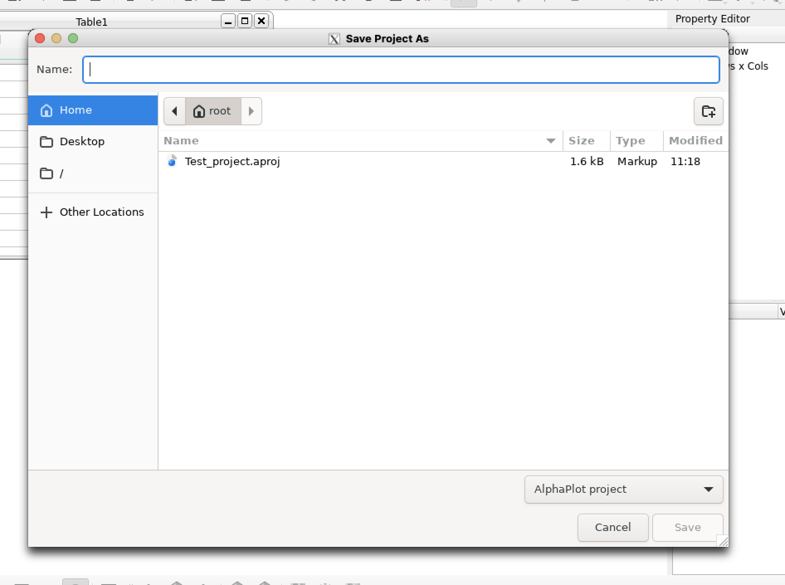

# `alphaplot` special

Nel caso in cui `alphaplot` non sia più supportato da un nuovo sistema operativo macOS, è possibile aggirera la questione utlizzando un docker container che permetta di utilizzarne una versione containerizzata su Linux/Ubuntu 24.04 LTS. 

## Installazione 

Per installare il software è necessario avere Docker installato localmente. Questo è facile (poiché avete installato, durante il setup iniziale, `brew`), e basta runnare il comando 

```bash
brew install docker
```

Questa operazione potrebbe richiedere qualche tempo e qualche GB di spazio sul disco. 

Una volta che Docker sarà installato sulla vostra macchina, potrete procedere con l'installazione completa del container. 

Vi basterà, dalla directory `CalcoloXFisica`, lanciare il comando 

```bash
docker build -t alphaplot alphaplot/
```
A questo punto, per aprire l'applicazione, sarà necessario eseguire lo script `alphaplot/start.sh`.

Per poter eseguire lo script in qualunque momento, è importante che salviate sul `$PATH` la posizione relativa a questa directory, eseguendo, da dentro `CalcoloXFisica/alphaplot/` il comando

```bash
echo PATH=$PATH:$PWD >> .zshrc
```

Questo consentirà di avere il comando `start.sh` raggiungibile da qualunque path vi troviate (non solo dallo standard)

## Utilizzo

Poiché state utilizzando un container, il file-system (aka, dove vengono salvati i files) non è lo stesso del vostro computer. 

Quando vorrete **salvare** un progetto di AlphaPlot, è FONDAMENTALE (altrimenti PERDERETE tutti i progressi) che lo facciate nella cartella `Home` (in alto a sinistra), nella subdirectory `AlphaPlot`. nella finestra pop-up che comparirà quando clickate su `File > Save Project (ctrl + S)` dalla finestra di AlphaPlot. 



Questa cartella è un alias per la cartella `alphalot-data` che si trova sul vostro computer in

```bash
cd ~/alphaplot-data
```

# Installazione di XQuartz 

Per utilizzare questo software è anche necessario avere una versione installata di XQuartz (necesssaria per avere l'interfaccia grafica)

Questa è ottenibile di nuovo attraverso `brew` con il comando

```bash
brew install --cask xquartz
```

È importante, dopo l'installazione, assicurarsi che il software accetti tutte le connessioni (anche quelle richieste dall'interfaccia grafica di AlphaPlot). Per questo, aprite l'applicazione e andate nelle impostazioni (una volta che l'applicazione è aperta, con la shortcut ⌘+,) e assicuratevi che nella sezione `Security` sia attivata (✅) l'opzione `Allow connections from network clients`. 
